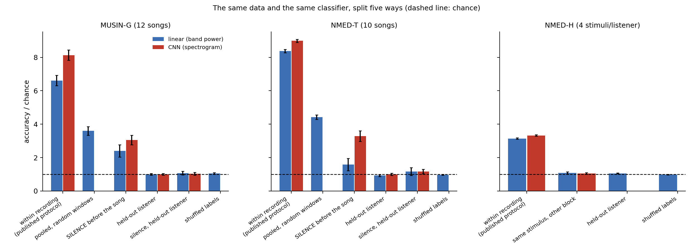
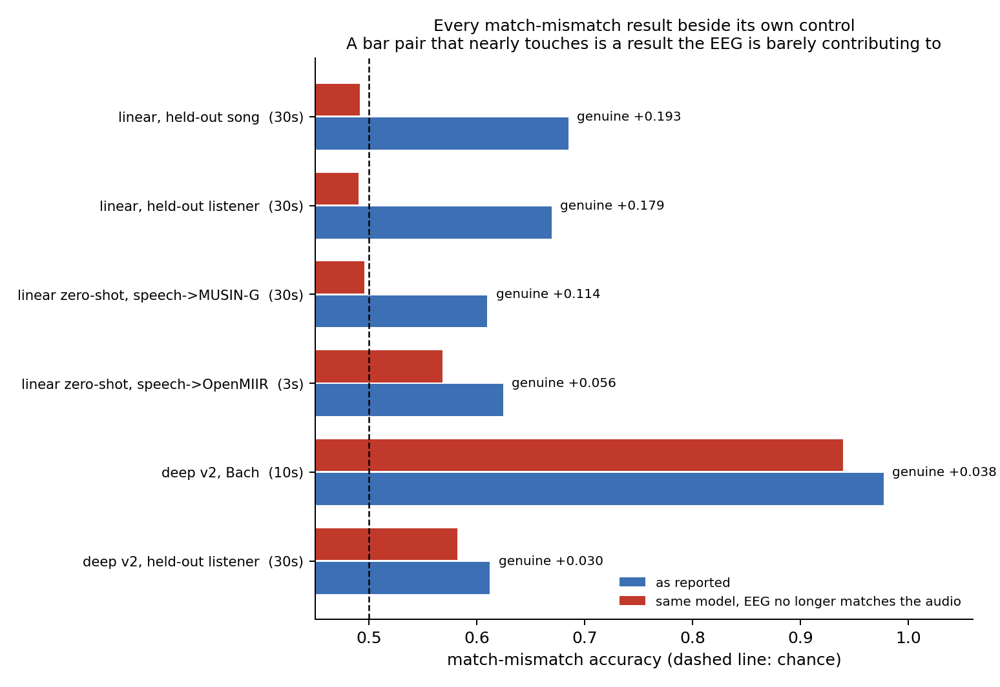
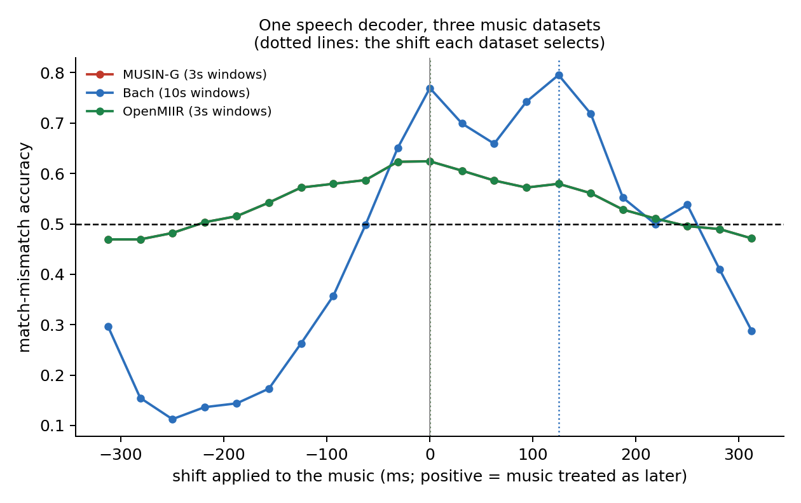

# eg606 — decoding naturalistic music from EEG, across listeners

Can we tell *which music someone is hearing*, and *when*, from their EEG — for a listener the model
has never seen? This repository contains the full pipeline: dataset acquisition, preprocessing,
linear baselines, a contrastive EEG↔audio model, and — the part that ended up mattering most — the
controls that say which of those results are real.

Course project for ES 606 (Computational Neuroscience), IIT Gandhinagar.

## 1. The usual protocol measures the recording, not the music

Published EEG music-identification results are usually obtained by splitting *one continuous
recording* into training and test windows. Reproducing that protocol across three public datasets
shows what it measures:



| dataset | chance | within recording | on **silence** | same stimulus, other block | held-out listener |
|---|---|---|---|---|---|
| MUSIN-G (12 songs, n=20) | .083 | **.551 (6.6×)** | .200 (2.4×) | — | .083 (1.0×) |
| NMED-T (10 songs, n=20) | .100 | **.838 (8.4×)** | .159 (1.6×) | — | .093 (0.9×) |
| NMED-H (4 stimuli/listener, n=48) | .250 | **.785 (3.1×)** | — | **.271 (1.1×)** | .264 (1.1×) |

The classifier "identifies" songs from the **silence before they start**, where no music is playing.
NMED-H says the same thing from the other side: hold the stimulus fixed and change only the
recording block, and 51 points of accuracy disappear. Held-out listeners sit at chance everywhere.

A *stronger* model makes this worse, not better. A spectrogram CNN reaches 8.1× chance within a
recording and reads 3.0× from silence, while generalising to a new listener exactly as badly.
Capacity buys leakage, not generalisation.

## 2. The protocol proposed to fix it needs a control of its own

The usual remedy is a time-locked **match–mismatch** task: given EEG and two candidate audio
excerpts — the true one and an imposter from the same song a second later — decide which produced
it. Both candidates share the recording, so slow drift cannot separate them. Chance is 50%.

That task can also be solved without reading the EEG at all. The test is a **derangement control**:
pair every audio target with a *different* trial's EEG, change nothing else, and score again.



| result | window | as reported | control | **genuine** |
|---|---|---|---|---|
| linear decoder, held-out listener | 30 s | 0.669 | **0.490** | **+0.179** |
| linear decoder, held-out song | 30 s | 0.685 | **0.492** | **+0.193** |
| linear, zero-shot speech → music | 30 s | 0.610 | 0.496 | +0.114 |
| contrastive model, held-out listener | 30 s | 0.612 | 0.582 | +0.030 (n.s.) |
| contrastive model, Bach | 10 s | 0.977 | **0.939** | +0.038 |

Two things leak. The imposter is always drawn *after* the true window, so the candidates differ
systematically in position and a biased scorer exploits that blind — randomising the side drops the
control to chance at 5 s. And when a stimulus is metronomic, as in the Bach set, every trial shares
a beat grid, so any trial's EEG is beat-phase aligned to any trial's audio; there the control
reaches 0.939.

The linear decoder passes both splits with its control at chance. The contrastive model does not
survive correction (q = 0.062) and is reported here as a negative result.

## 3. Cross-dataset timing



A decoder trained on **speech** transfers to music, but only when the two datasets agree about when
the sound began. MUSIN-G's event markers lag its audio by about **62 ms** — the same estimate in
every frequency band tested, which is what a fixed delay in a recording chain looks like and a
neural latency difference is not. OpenMIIR, whose authors recorded a dedicated audio-onset marker
and corrected for it, needs **0 ms** under the identical analysis, and its own measured
trigger-to-audio latency is 11.7 ms.

## Layout

```
src/eg606/
  data/download/   dataset downloaders (stdlib only), resumable and size-verified
  data/import_local.py  install datasets that block scripted download (Dryad)
  prep/            preprocessing per dataset -> 64 Hz epochs aligned to audio features
  audio/           envelope and onset (spectral flux) features, one definition for all datasets
  eval/            protocol comparison, match-mismatch, transfer, latency analysis, song ID
  models/          contrastive EEG-audio model; VLAAI zero-shot wrapper
  train/           training loop and cross-validation (by listener, by song, or both)
scripts/           server sync, Slurm templates, publishing
tools/             one-off inspection scripts, kept because they document how facts were established
configs/           job configurations
```

## Getting the data

```bash
python -m eg606.data.download all --status     # what is present and what is missing
python -m eg606.data.download musin_g          # resumable; rerun to continue
python -m eg606.data.import_local --list       # datasets needing a browser download
```

| Dataset | Content | Audio |
|---|---|---|
| [MUSIN-G](https://openneuro.org/datasets/ds003774) | 20 listeners, 12 songs, 128-ch EGI | included |
| [SparrKULee](https://rdr.kuleuven.be/dataset.xhtml?persistentId=doi:10.48804/K3VSND) | 85 listeners, 168 h speech, 64-ch BioSemi | included |
| [Bach: music of silence](https://datadryad.org/dataset/doi:10.5061/dryad.dbrv15f0j) | 21 musicians, 4 melodies × 11 repeats | included |
| [NMED-T](https://purl.stanford.edu/jn859kj8079) / [NMED-H](https://purl.stanford.edu/sd922db3535) | naturalistic music EEG, 20 / 48 listeners | metadata only |
| [OpenMIIR](https://github.com/sstober/openmiir) | 10 listeners, 12 fragments, 64-ch BioSemi | stimuli included; EEG by BitTorrent only |

Set `EG606_DATA` to choose where data lives (default: the NAS path in `eg606/paths.py`).

## Running the pipeline

```bash
python -m eg606.prep.musin_g --subjects all --clean basic          # preprocess
python -m eg606.prep.musin_g --subjects all --to-montage biosemi64 # shared montage for transfer
python -m eg606.prep.sparrkulee --subjects all
python -m eg606.prep.bach

python -m eg606.eval.protocol --variant basic --feature onset --splits naive,loso,song
python -m eg606.eval.songid --variant basic                        # the leakage figure
python -m eg606.eval.latency --band 4,8                            # response-latency analysis
python -m eg606.train.cv --dataset music --model v2 --cv 5 --cv-by song
```

`scripts/sync.sh` mirrors the code to compute servers and submits jobs (`push`, `sbatch`, `status`);
copy `scripts/servers.env.example` to `scripts/servers.env` with your own machines first.

## Requirements

Python 3.10+, NumPy/SciPy, MNE-Python, scikit-learn, PyTorch (CUDA optional), ONNX Runtime for the
VLAAI baseline. `pip install -e ".[prep,audio,train]"`.

## Credits

Datasets are the work of their authors (cited above); please follow their licences. VLAAI weights
come from [exporl/vlaai](https://github.com/exporl/vlaai). The match–mismatch formulation follows the
auditory-EEG literature (Accou et al.; the ICASSP Auditory EEG Challenges).
